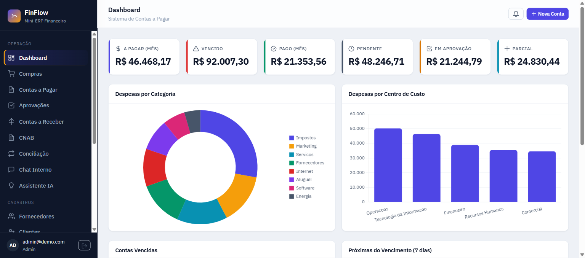
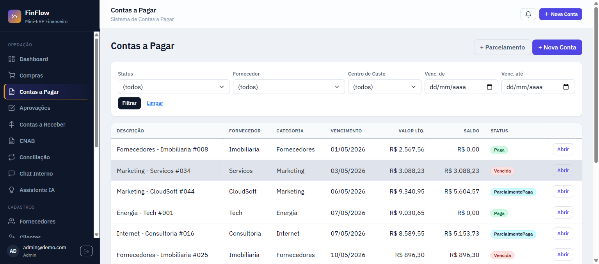
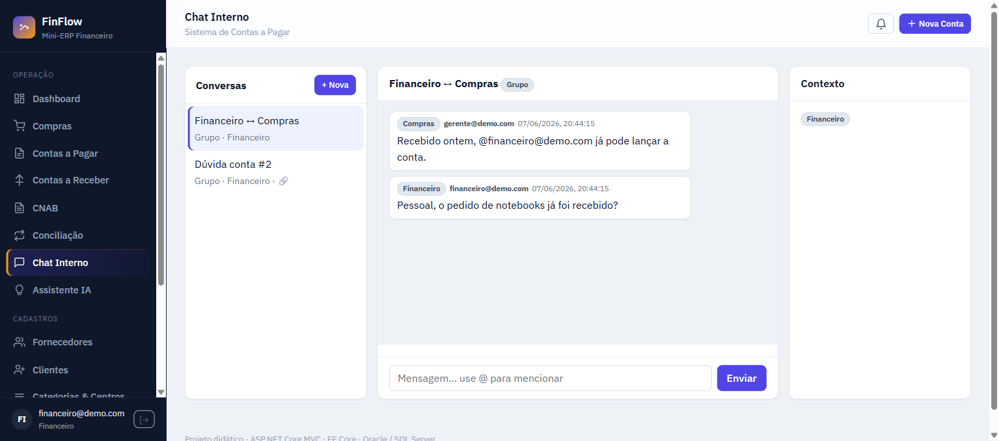
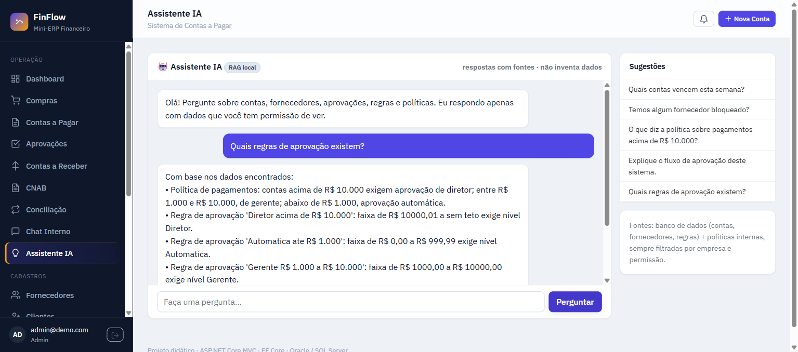
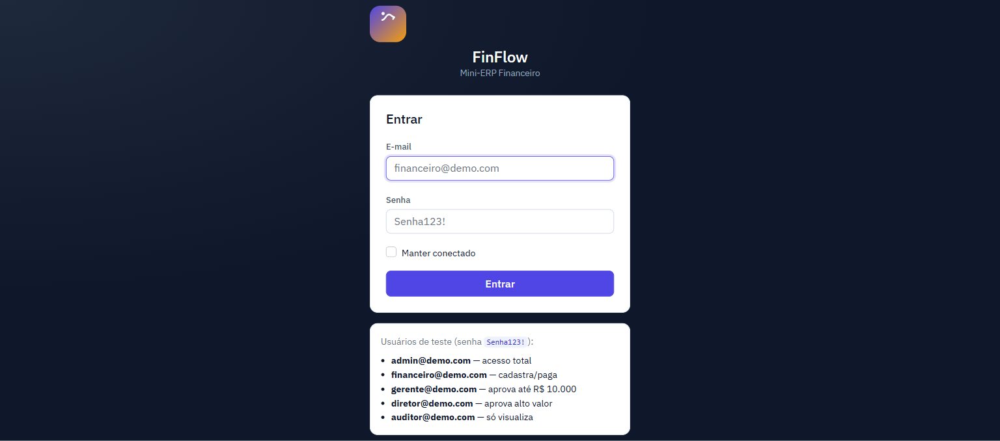

<p align="center">
  
</p>

<h1 align="center">FinFlow — Mini-ERP Financeiro</h1>

<p align="center"><em>Projeto de estudo · Contas a Pagar/Receber · Fluxo de Caixa · Chat (SignalR) · Assistente IA (RAG)</em></p>


**Mini-ERP financeiro** construído com **ASP.NET Core MVC + Entity Framework Core**, partindo de um módulo de **Contas a Pagar** e evoluindo para um sistema corporativo brasileiro completo: Contas a Receber, Fluxo de Caixa, Compras, aprovações por alçada configuráveis, integração bancária (fake) com webhooks/estorno, CNAB, conciliação, anexos, auditoria, multiempresa, **chat interno em tempo real (SignalR)** e **assistente de IA com RAG**.

> 🎓 **Projeto 100% didático.** Feito para **estudar, debugar, quebrar, corrigir e evoluir** .NET MVC, EF Core, arquitetura limpa, regras financeiras, testes, frontend e IA. **Não use em produção** — dados, usuários, integrações bancárias, banco e provedor de IA são **fake/seed** (ver [Aviso](#-aviso)).

**Destaques:** Clean Architecture (4 projetos) · 15 fases de ERP + 2 módulos extras · **93 testes verdes** (83 unit + 10 integration) · observabilidade (Serilog + health checks) · Docker + CI · UI temática própria · RAG local (sem API key) com isolamento por permissão/empresa.

> 📸 **Screenshots:** veja a pasta [`docs/img`](docs/img) (dashboard, contas, chat e assistente IA).

---

## Índice

1. [O que é um ERP](#1-o-que-é-um-erp)
2. [Como funciona um ERP](#2-como-funciona-um-erp)
3. [Módulos do FinFlow](#3-módulos-do-finflow)
4. [Por que e quando usar um ERP](#4-por-que-e-quando-usar-um-erp)
5. [Regras de negócio implementadas](#5-regras-de-negócio-implementadas)
6. [Tecnologias](#6-tecnologias-utilizadas)
7. [Pré-requisitos e instalação](#7-pré-requisitos-e-instalação)
8. [Como rodar](#8-como-rodar)
9. [Configurar banco (Oracle / SQL Server / InMemory)](#9-configurar-banco-de-dados)
10. [Migrations e Seed](#10-migrations-e-seed)
11. [URLs e usuário de teste](#11-urls-principais-e-usuário-de-teste)
12. [Como debugar (VS / VS Code)](#12-como-debugar)
13. [Como testar os fluxos](#13-como-testar-os-fluxos)
14. [Estrutura de pastas](#14-estrutura-de-pastas)
15. [Integração bancária real (futuro)](#15-como-integrar-com-bancos-reais-futuramente)
16. [Como expandir o projeto](#16-como-expandir-este-projeto)
17. [Troubleshooting](#17-troubleshooting)
18. [Próximos passos](#18-próximos-passos)
19. [Testes, Observabilidade & CI](#23-testes-observabilidade--ci-fase-1)
20. [Roadmap / fases do mini-ERP](#24-roadmap-de-evolução-mini-erp)
21. [Chat interno (SignalR) & Assistente IA (RAG)](#25-chat-interno-signalr--assistente-ia-rag)
22. [Aviso](#-aviso) · [Licença](#-licença)

---

## ⚠️ Aviso

Projeto **exclusivamente educacional**. Tudo que parece "real" é **simulado**:

- **Usuários/senhas** são de seed (`admin@demo.com` … senha `Senha123!`) — troque/remova antes de qualquer uso sério.
- **Integração bancária, webhooks, CNAB e PIX/TED/boleto** são **fakes** (nenhuma API de banco é chamada).
- **Assistente de IA (RAG)** usa embeddings e LLM **locais/fake** por padrão — **não** envia dados a provedores externos e **não** inventa respostas.
- **Banco padrão é InMemory**; dados somem ao reiniciar. Não há dados pessoais reais.
- **Tokens/segredos** no `appsettings` são placeholders de desenvolvimento. Em produção use variáveis de ambiente / secret manager.

> Encontrou uma inconsistência? Ótimo — é um repo de estudo. Veja [Como expandir](#16-como-expandir-este-projeto) e o roadmap.

---

## 🖼️ Telas

| Dashboard | Contas a Pagar |
|---|---|
|  |  |

| Chat interno (SignalR) | Assistente IA (RAG) |
|---|---|
|  |  |

<p align="center"></p>

---

## 1. O que é um ERP

**ERP** (*Enterprise Resource Planning* — Planejamento de Recursos da Empresa) é um sistema que **integra, em um único lugar, os processos e os dados das várias áreas** de uma empresa — financeiro, compras, vendas, estoque, fiscal, RH — no lugar de planilhas e sistemas isolados que não conversam entre si.

A ideia central: **um dado é cadastrado uma vez e reaproveitado por todos os módulos**. Um fornecedor cadastrado serve para Compras, Contas a Pagar e relatórios; um pedido de compra recebido vira automaticamente uma conta a pagar; um pagamento atualiza o fluxo de caixa e a conciliação. Tudo com **permissões por perfil**, **trilha de auditoria** e suporte a **múltiplas empresas**.

> O **FinFlow** é um **mini-ERP focado no domínio financeiro**. Começou no módulo de Contas a Pagar e cresceu para um sistema com Contas a Receber, Fluxo de Caixa, Compras e vários módulos de apoio — mantendo o caráter didático. **Contas a Pagar é só um dos módulos.**

## 2. Como funciona um ERP

Pilares de um ERP — todos implementados aqui:

- **Núcleo de dados compartilhado** — cadastros (parceiros, centros de custo, categorias, contas bancárias) usados por todos os módulos, num único banco/`DbContext`.
- **Módulos integrados** — cada área é um módulo, mas eles **disparam ações uns nos outros**. Ex.: *Compra recebida → gera Conta a Pagar*; *Pagamento → atualiza Fluxo de Caixa e Conciliação*; *Aprovação pendente → notifica o perfil responsável*.
- **Processos que cruzam módulos** — fluxos de ponta a ponta, não telas isoladas.
- **Perfis e permissões (RBAC)** — Admin, Financeiro, Gerente, Diretor, Auditor: cada um vê/faz o que sua função permite.
- **Multiempresa (multitenant)** — dados isolados por empresa; um usuário não enxerga dados de outra.
- **Governança** — auditoria de quem fez o quê, aprovações por alçada, notificações.
- **Camada de integração** — bancos, CNAB, webhooks, API REST e até IA (assistente RAG) plugáveis.

Fluxo principal do FinFlow:
```
 Compras ──────► Contas a Pagar ─┐
 (Vendas) ─────► Contas a Receber ┼──► Fluxo de Caixa ──► Dashboard / Relatórios
 Bancos ───────► Conciliação ─────┘            ▲
        Aprovações · Auditoria · Notificações · Chat interno · Assistente IA
```
Exemplo de processo (ciclo de compra):
`Solicitação → Aprovação → Pedido → Recebimento → Conta a Pagar → Pagamento → Conciliação → Auditoria`.

## 3. Módulos do FinFlow

**Núcleo / cadastros**
| Módulo | O que faz |
|---|---|
| Empresas (multitenant) | isola todos os dados por empresa |
| Parceiros | Fornecedores **e** Clientes (CPF/CNPJ, dados bancários/PIX, status) |
| Centros de custo & Categorias | classificação de despesas/receitas |
| Contas bancárias | contas da empresa de onde sai/entra dinheiro |

**Processos financeiros**
| Módulo | O que faz |
|---|---|
| **Compras** | Solicitação → Aprovação → Pedido → Recebimento → **gera Conta a Pagar** |
| **Contas a Pagar** | obrigações: 11 status, parcelamento, juros/multa, retenção de impostos, baixa |
| **Contas a Receber** | faturas de clientes, recebimento total/parcial, inadimplência |
| **Fluxo de Caixa** | consolida AP + AR + saldos; projeções 7/30/90 dias |
| **Workflow de Aprovação** | alçadas configuráveis (valor/categoria/centro/fornecedor) |

**Integrações**
| Módulo | O que faz |
|---|---|
| Integração bancária | PIX/TED/boleto (fake: BB/Itaú/Santander) + estorno + webhooks + retry |
| CNAB | geração de remessa e processamento de retorno |
| Conciliação bancária | importa extrato CSV e casa com pagamentos |
| Anexos | NF/boleto/contrato/comprovante (disco → pronto p/ S3) |
| API REST + Swagger | `/api/v1/*` para integração externa |

**Governança & colaboração**
| Módulo | O que faz |
|---|---|
| Autenticação & RBAC | 5 perfis, proteção de rotas MVC + API |
| Auditoria | trilha de quem fez o quê (com IP e motivo) |
| Notificações | sininho interno + canais fake (e-mail/WhatsApp) |
| Jobs (Hangfire) | rotinas: marcar vencidas, alertas, retry bancário |
| **Chat interno (SignalR)** | conversas entre áreas em tempo real, vinculadas a processos |
| **Assistente IA (RAG)** | perguntas em linguagem natural, com fontes, respeitando permissão/empresa |

**Análise & operação**
| Módulo | O que faz |
|---|---|
| Dashboard | KPIs + gráficos (Chart.js) |
| Relatórios | vencidas, a vencer, por fornecedor/centro/categoria, impostos, por banco |
| Observabilidade | Serilog, health checks, página de Status |

## 4. Por que e quando usar um ERP

**Por que:** sem um ERP, cada área vive em planilhas/sistemas isolados → dado duplicado e inconsistente, retrabalho, pagamento em atraso ou duplicado, falta de visão de caixa, zero rastreabilidade. Um ERP **unifica o dado, automatiza os fluxos entre áreas e impõe governança** (aprovações, auditoria, permissões).

**Quando:** empresas com vários fornecedores/clientes, que exigem aprovação antes de pagar, têm despesas recorrentes/parceladas, retêm impostos, querem integrar com bancos, precisam de relatórios confiáveis e de **isolar dados por empresa**.

## 5. Regras de negócio implementadas

**Fornecedor**
- Razão social obrigatória; CPF/CNPJ validado (dígitos verificadores); documento único.
- Fornecedor **Bloqueado/Inativo não recebe pagamento**.

**Conta a pagar**
- Valor > 0; vencimento, fornecedor, categoria e centro de custo obrigatórios.
- Conta **Paga/Cancelada/Estornada/Parcial não pode ser editada livremente**.
- Conta **Cancelada não pode ser paga**; **Reprovada não pode ser paga**.
- Conta vencida exibe **valor atualizado** (multa + juros).

**Aprovação (alçada — configurável em `appsettings`)**
- `< R$ 1.000` → **aprovação automática**
- `R$ 1.000 a R$ 10.000` → **gerente**
- `> R$ 10.000` → **diretor**
- Registra aprovador, data e observação; permite reprovar.

**Pagamento / baixa**
- Valor pago = devido → **Paga**; menor → **Parcialmente Paga**; maior → exige **justificativa**.
- Registra baixa + transação bancária simulada; banco pode retornar **sucesso / pendente / erro**.

**Juros e multa**
- Multa percentual (única) + juros ao dia × dias de atraso, sobre o saldo devedor.

**Retenção de impostos**
- `Valor líquido = valor original − Σ impostos retidos`.

## 6. Tecnologias utilizadas

- **.NET 8** (LTS) · **ASP.NET Core MVC** · **Razor Views** · **Bootstrap 5** · **Chart.js**
- **Entity Framework Core 8** (Oracle / SQL Server / InMemory)
- **CsvHelper** (importação de extrato)
- Injeção de dependência, Service Layer, Options pattern, Repository (demonstração)

### Pacotes NuGet
```
Microsoft.EntityFrameworkCore
Microsoft.EntityFrameworkCore.Design
Microsoft.EntityFrameworkCore.InMemory
Oracle.EntityFrameworkCore
Microsoft.EntityFrameworkCore.SqlServer
CsvHelper
```

---

## 7. Pré-requisitos e instalação

- **.NET SDK 8** (ou superior — o projeto usa `RollForward=LatestMajor`, então roda com SDK/runtime 10 também).
- (Opcional) **Docker** para subir Oracle ou SQL Server.

Instalar o SDK: https://dotnet.microsoft.com/download

```bash
dotnet --version          # verificar SDK
dotnet restore            # restaurar pacotes
dotnet build              # compilar
```

## 8. Como rodar

### Opção A — sem banco (mais rápido, recomendado para estudar)
O provider padrão é **InMemory**: a aplicação cria o schema em memória e roda o **seed** automaticamente. Não precisa de Docker nem banco.

```bash
cd src/ContasAPagar.Web
dotnet run
```
Abra a URL exibida no console (algo como `http://localhost:5063`).

### Opção B — com Docker (Oracle)
```bash
docker compose up -d                       # sobe Oracle (aguarde ~1-3 min no 1o boot)
# edite src/ContasAPagar.Web/appsettings.json:
#   Database:Provider = "Oracle"
#   ConnectionStrings:Default = "User Id=appuser;Password=AppUser123;Data Source=localhost:1521/FREEPDB1;"
cd src/ContasAPagar.Web
dotnet run
docker compose down                        # parar o banco
```

## 9. Configurar banco de dados

Tudo é controlado por **`appsettings.json`**:

```jsonc
{
  "Database": { "Provider": "InMemory" },   // Oracle | SqlServer | InMemory
  "ConnectionStrings": {
    "Default": ""                            // preencha conforme o provider
  }
}
```

**Connection strings de exemplo**
```text
Oracle:     User Id=appuser;Password=AppUser123;Data Source=localhost:1521/FREEPDB1;
SqlServer:  Server=localhost,1433;Database=ContasAPagar;User Id=sa;Password=Your_password123;TrustServerCertificate=True;
```

> ⚠️ **Segurança:** não comite senhas reais. Em produção use variáveis de ambiente / user-secrets:
> ```bash
> dotnet user-secrets set "ConnectionStrings:Default" "..."
> # ou
> setx ConnectionStrings__Default "..."      # Windows
> export ConnectionStrings__Default="..."     # Linux/macOS
> ```

### Como trocar Oracle por SQL Server
1. `Database:Provider = "SqlServer"`.
2. Ajuste a connection string (exemplo acima).
3. (Opcional) suba o serviço `sqlserver` comentado no `docker-compose.yml`.
4. Recrie as migrations específicas do provider (ver abaixo).

## 10. Migrations e Seed

Com **InMemory** o schema é criado via `EnsureCreated()` e **não precisa de migrations**.

Para bancos relacionais (Oracle/SQL Server), gere migrations:
```bash
cd src/ContasAPagar.Web
dotnet tool install --global dotnet-ef       # se ainda não tiver
dotnet ef migrations add InitialCreate
dotnet ef database update
```
No startup, a aplicação aplica migrations automaticamente se existirem (senão usa `EnsureCreated`).

**Seed:** roda sozinho no primeiro start (banco vazio) — cria 10 fornecedores, 5 centros de custo, 8 categorias, 3 contas bancárias e ~50 contas a pagar em estados variados (pagas, vencidas, pendentes, parceladas, com imposto, parcialmente pagas, aguardando aprovação, com transação bancária fake e algumas conciliadas). Veja `Data/DataSeeder.cs`.

## 11. URLs principais e usuário de teste

| Tela | Rota |
|------|------|
| Dashboard | `/Dashboard` |
| Contas | `/Contas` |
| Nova conta | `/Contas/Create` |
| Parcelamento | `/Contas/Parcelar` |
| Aprovações | `/Aprovacoes` |
| Fornecedores | `/Fornecedores` |
| Conciliação | `/Conciliacao` |
| Relatórios | `/Relatorios` |
| Cadastros | `/Cadastros` |
| Auditoria | `/Auditoria` |

**Usuário fake:** não há autenticação nesta versão. As ações são registradas como `operador.financeiro`. Veja seção 16 para adicionar login.

## 12. Como debugar

**Visual Studio:** abra `ContasAPagar.sln`, defina `ContasAPagar.Web` como startup, F5. Coloque breakpoints nos Services (ex.: `PagamentoService.BaixarAsync`, `AprovacaoService.EnviarParaAprovacaoAsync`).

**VS Code:** abra a pasta, instale o C# Dev Kit, `F5` (gera `launch.json`). Ou rode `dotnet watch run` em `src/ContasAPagar.Web` para hot reload.

Pontos interessantes para breakpoint:
- `Services/ContaPagarService.cs` → criação, edição, parcelamento, retenção.
- `Services/AprovacaoService.cs` → alçadas.
- `Services/PagamentoService.cs` → baixa + integração bancária.
- `Services/JurosMultaService.cs` → cálculo de encargos.
- `Integrations/Banking/FakeBankPaymentService.cs` → simulação do retorno do banco.

## 13. Como testar os fluxos

**Fluxo de contas:** `/Contas/Create` → crie uma conta (informe alíquotas de imposto se quiser ver o líquido mudar) → abra os detalhes.

**Aprovação:** nos detalhes, "Enviar para Aprovação".
- Valor < R$ 1.000 → aprova automaticamente e fica **Liberada para pagamento**.
- Valor ≥ R$ 1.000 → vai para `/Aprovacoes`; aprove ou reprove ali.

**Pagamento:** nos detalhes de uma conta liberada/pendente/vencida → "Pagar / Baixar".
- Pague valor menor → vira **Parcialmente Paga**.
- Pague o saldo → vira **Paga**.
- A integração bancária fake retorna **sucesso/pendente/erro** aleatoriamente (~80/10/10).

**Integração bancária fake:** cada baixa cria uma `BankTransaction` com payload de envio/resposta — visível nos detalhes da conta.

**Conciliação / importar CSV:** `/Conciliacao` → "Importar Extrato CSV" usando `data/extrato-exemplo.csv`.
- O sistema concilia automaticamente por **valor + data** (tolerância de 3 dias). Dica: registre pagamentos no app e depois monte um CSV com os mesmos valores/datas para ver o match automático. Sempre dá para **conciliar manualmente** informando o ID da conta.

**Formato do CSV** (delimitador `;`):
```
Data;Descricao;Valor;Documento;Banco;Tipo
05/06/2026;PAGAMENTO PIX FORNECEDOR TECH;1250,00;PIX0001;Banco do Brasil;PIX
```

## 14. Estrutura de pastas

```
05-contas-a-pagar-net8/
├── docker-compose.yml            # Oracle (e SQL Server comentado)
├── data/extrato-exemplo.csv      # extrato fake para conciliação
├── ContasAPagar.sln
└── src/ContasAPagar.Web/
    ├── Program.cs                # DI, provider do banco, seed, pipeline
    ├── appsettings.json          # Provider, connection strings, Financeiro
    ├── Domain/
    │   ├── Entities/             # Fornecedor, ContaPagar, BankTransaction, ...
    │   └── Enums/                # StatusConta, FormaPagamento, ...
    ├── Data/
    │   ├── AppDbContext.cs
    │   ├── Configurations/       # IEntityTypeConfiguration (relacionamentos/índices)
    │   └── DataSeeder.cs
    ├── Services/                 # regra de negócio (Service Layer)
    │   └── Interfaces/
    ├── Repositories/             # Repository genérico (demonstração)
    ├── Integrations/
    │   ├── Banking/              # IBankPaymentService + fakes + factory
    │   └── Conciliacao/          # mapeamento CSV
    ├── Configurations/           # FinanceiroOptions (Options pattern)
    ├── ViewModels/               # entrada/saída das telas
    ├── Helpers/                  # OperationResult, PagedResult, validações, UI
    ├── Controllers/              # finas — delegam para Services
    └── Views/                    # Razor + Bootstrap
```

## 15. Como integrar com bancos reais futuramente

A integração já está **estruturada para troca**. Hoje os serviços são fakes; amanhã basta criar **adapters reais** implementando a mesma porta `IBankPaymentService`.

**Arquitetura alvo**
```
IBankPaymentService            // porta neutra de banco (já existe)
  ├─ BankPaymentRequest        // contrato de entrada (já existe)
  ├─ BankPaymentResponse       // contrato de saída (já existe)
  ├─ ItauBankAdapter           // adapter real (futuro)
  ├─ BancoBrasilBankAdapter    // adapter real (futuro)
  └─ SantanderBankAdapter      // adapter real (futuro)
```

**Checklist para integração real**
- Um **adapter por banco** implementando `IBankPaymentService`.
- **DTOs específicos por banco** (cada API tem seu formato) convertidos de/para os contratos neutros.
- **Autenticação**: OAuth2 / client credentials / certificado (mTLS), conforme o banco.
- **Logs** de requisição e resposta (já temos `PayloadEnvio`/`PayloadResposta` em `BankTransaction`).
- **Tratamento de erro** e **retentativas** (Polly) com backoff.
- **Webhooks** de confirmação e **consulta de status** de pagamento (PIX/TED/boleto).
- **Segurança de dados sensíveis**: criptografia de credenciais, **nunca** salvar chaves/senhas no código; usar **variáveis de ambiente** / secret manager.

> A `BankTransaction` já guarda banco, tipo, status, código da transação, payloads, datas e mensagem de erro — exatamente o que você precisa logar numa integração real.

### Como adicionar um novo banco (fake ou real)
1. Crie a classe implementando `IBankPaymentService` (ex.: herde de `FakeBankPaymentService` para fake).
2. Adicione o valor no enum `BancoIntegracao`.
3. Registre no `Program.cs` (`AddScoped<IBankPaymentService, SeuBanco>()`). A `BankPaymentServiceFactory` resolve pelo `BancoIntegracao` da conta bancária.

### Como adicionar novos tipos de pagamento
Adicione ao enum `FormaPagamento` e trate no adapter/serviço bancário.

### Como adicionar novas regras de aprovação
Ajuste os limites em `appsettings → Financeiro` ou evolua `AprovacaoService.DeterminarNivel` para um workflow multi-nível.

## 16. Como expandir este projeto

- **Autenticação/Autorização** com ASP.NET Identity; perfis: financeiro, gerente, diretor, admin (troque `BaseController.UsuarioAtual` pelo usuário logado).
- **Testes automatizados**: xUnit + FluentAssertions (services), `WebApplicationFactory` (integração). Os Services já recebem dependências por interface — fáceis de mockar.
- **CNAB** (geração/retorno bancário), **webhooks**, **NF-e**, integração com **ERP**, **compras** e **contas a receber**.
- **Notificações** (e-mail/WhatsApp), **anexos** de comprovante, **workflow** de aprovação.
- **Deploy** Docker/Kubernetes, **observabilidade** (Serilog + métricas + tracing).
- **API auxiliar + Swagger** (exponha os Services como endpoints REST).

## 17. Troubleshooting

| Problema | Solução |
|----------|---------|
| `framework 'Microsoft.AspNetCore.App' 8 not found` | Instale o runtime .NET 8 **ou** mantenha `RollForward=LatestMajor` (já configurado) para rodar com o runtime 10. |
| App não conecta no Oracle | Aguarde o healthcheck (`docker compose ps`); 1º boot do Oracle leva minutos. Confira a connection string `FREEPDB1`. |
| `dotnet ef` não encontrado | `dotnet tool install --global dotnet-ef`. |
| Quero zerar os dados (InMemory) | Reinicie a app (memória volátil). Relacional: `docker compose down -v` e recrie. |
| Porta ocupada | Edite `Properties/launchSettings.json` ou `ASPNETCORE_URLS`. |
| CSV não concilia automaticamente | Garanta valores/datas próximos de pagamentos existentes; senão use conciliação manual. |

## 18. Próximos passos

1. Suba o Oracle e gere as migrations reais.
2. Adicione autenticação (Identity) e amarre a auditoria ao usuário logado.
3. Escreva testes para `ContaPagarService`, `AprovacaoService` e `PagamentoService`.
4. Troque um fake por um adapter bancário real (sandbox PIX).
5. Exponha uma API + Swagger e plugue um front separado, se quiser.

---

## 23. Testes, Observabilidade & CI (Fase 1)

### Estrutura de testes
```
tests/
├── AccountsPayable.Tests.Unit          # xUnit + Moq + FluentAssertions (regra de negócio pura)
├── AccountsPayable.Tests.Integration   # WebApplicationFactory + Testcontainers Oracle (pipeline real)
└── AccountsPayable.Tests.E2E           # Playwright (usuário real no navegador)
```

### Como rodar os testes
```bash
# Unitários (rápidos, sem dependências externas) — 83 testes
dotnet test tests/AccountsPayable.Tests.Unit

# Integração (sobe Oracle efêmero via Testcontainers — EXIGE Docker rodando)
dotnet test tests/AccountsPayable.Tests.Integration

# E2E (precisa da app no ar + browser do Playwright)
dotnet run --project src/ContasAPagar.Web --urls http://localhost:5080 &   # 1) sobe a app
pwsh tests/AccountsPayable.Tests.E2E/bin/Debug/net8.0/playwright.ps1 install chromium  # 2) browser (1x)
E2E_BASE_URL=http://localhost:5080 dotnet test tests/AccountsPayable.Tests.E2E         # 3) roda E2E

# Relatório de testes (.trx) + cobertura
dotnet test --logger "trx" --collect:"XPlat Code Coverage"
```

**O que os testes unitários cobrem hoje (todos verdes):**
| Arquivo | Cobre |
|---|---|
| `JurosMultaServiceTests` | multa/juros: sem atraso, com atraso, base = saldo devedor |
| `AprovacaoNivelTests` | alçadas (auto < 1.000 ≤ gerente ≤ 10.000 < diretor) |
| `DocumentoValidatorTests` | CPF/CNPJ válido/inválido, normalização |
| `ContaPagarServiceTests` | retenção→líquido, valor zero, parcelamento (divisão + resto), cancelar conta paga |
| `FornecedorServiceTests` | nome obrigatório, documento inválido, duplicado, persistência |
| `BankPaymentFactoryTests` | factory resolve adapter por banco; payloads de envio/resposta |

> **Onde adicionar testes de cada módulo:** espelhe a pasta `Services/`. Cada novo Service ganha um `XServiceTests.cs`. Use `TestSupport.NewDb()` (AppDbContext InMemory isolado) e `Moq` para `IAuditoriaService`/integrações.

### Observabilidade
- **Serilog** — logs estruturados em console + arquivo (`logs/contas-a-pagar-*.log`). Config em `Program.cs`.
- **CorrelationId** — `CorrelationIdMiddleware` injeta um id por request (header `X-Correlation-ID`) em todos os logs do fluxo.
- **Request logging** — `UseSerilogRequestLogging` resume cada request (rota, status, tempo).
- **Health checks** — `GET /health` (máquina) + página **`/Status`** (humana: saúde, ambiente, banco, versão, uptime).

### Docker da aplicação
```bash
docker compose up -d --build        # sobe Oracle + app (porta 8080)
# abra http://localhost:8080
```
`Dockerfile` multi-stage (sdk:8.0 → aspnet:8.0). App conecta no Oracle do compose via `Database__Provider=Oracle`.

### CI — GitHub Actions
`.github/workflows/ci.yml` com 3 jobs: **build-and-unit** → **integration** (Testcontainers Oracle no runner Docker) + **e2e** (Playwright). Sobe artefatos `.trx`.
> **Monorepo:** o GitHub só dispara workflows do `.github/` na **raiz** do repositório. Se este projeto for subpasta, mova o `ci.yml` para `<raiz>/.github/workflows/` e ajuste `working-directory`.

## 24. Roadmap de evolução (mini-ERP)

| Fase | Entrega | Status |
|---|---|---|
| **1 — Fundação** | Testes (unit/integração/E2E), Serilog+CorrelationId, health/status, Docker app, CI | ✅ **feito** |
| **2 — Auth + RBAC** | ASP.NET Identity; perfis Admin/Financeiro/Gerente/Diretor/Auditor; proteção de rotas MVC+API; testes de permissão | ✅ **feito** |
| **6 — Contas a Receber** | clientes, faturas, baixa total/parcial, inadimplência | ✅ **feito** |
| **7 — Fluxo de Caixa** | consolida AP+AR+saldos; projeções 7/30/90 dias + gráfico | ✅ **feito** |
| **11 — Jobs** | Hangfire (InMemory): job recorrente de vencidas + alertas; painel /hangfire (Admin) | ✅ **feito** |
| **13 — API REST + Swagger** | endpoints `/api/v1/*` (AP, AR, suppliers, cash-flow), paginação/filtros, envelope, Swagger | ✅ **feito** |
| **3 — Workflow configurável** | `RegraAprovacao` por valor/categoria/centro/fornecedor; regra mais específica vence; CRUD (Admin) | ✅ **feito** |
| **4 — Integração bancária robusta** | estado Estornado, estorno de pagamento, `BankWebhookEvent` + endpoint `/api/v1/bank/webhook`, retry job | ✅ **feito** |
| **5 — CNAB fake** | gerar remessa (`.rem`) + processar retorno (confirma/rejeita/ignora) | ✅ **feito** |
| **8 — Compras→Pedido→AP** | Solicitação→Aprovação→Pedido→Recebimento gera Conta a Pagar (sem recebimento, sem AP) | ✅ **feito** |
| **9 — Anexos** | upload NF/boleto/contrato/comprovante (disco via `IFileStorage`, pronto p/ S3), validação ext/tamanho | ✅ **feito** |
| **10 — Auditoria avançada** | + IP (auto) e Motivo nas alterações críticas | ✅ **feito** |
| **12 — Notificações** | sininho interno + canais fake (e-mail/WhatsApp); evento em aprovação | ✅ **feito** |
| **14 — Multiempresa** | `Empresa` + `ITenantOwned`; filtro global por empresa (query filter); claim + middleware de tenant | ✅ **feito** |
| **15 — Clean Architecture** | separação física em projetos Web/Application/Infrastructure/Domain | ✅ **feito** |

### Fase 15 — Clean Architecture (separação física)
A solução está dividida em **4 projetos** com direção de dependência imposta por `ProjectReference`:

```
src/
├── ContasAPagar.Domain/           # Entities, Enums, Identity, Helpers (OperationResult/Paged/Validator), Configurations
├── ContasAPagar.Infrastructure/   # Data (EF/DbContext/Seed), Integrations, Repositories, Infra (jobs/tenancy/observability)  → ref Domain
├── ContasAPagar.Application/       # Services + Interfaces, ViewModels, Jobs                                                  → ref Infrastructure, Domain
└── ContasAPagar.Web/              # Controllers, Api, Views, ViewComponents, Program, wwwroot                                 → ref Application
tests/
├── AccountsPayable.Tests.Unit / .Integration / .E2E
```

Fluxo: **Web → Application → Infrastructure → Domain** (Domain não depende de ninguém).
> Os namespaces foram mantidos como `ContasAPagar.Web.*` para preservar compatibilidade; o que muda é o **assembly** (camada) onde cada tipo vive e a **direção de dependência** entre projetos.

### Novos módulos no menu
**Compras** (solicitação→pedido→recebimento), **Contas a Receber**, **Clientes**, **Fluxo de Caixa**, **CNAB**, **Notificações** (sininho no topo), e para **Admin**: **Regras de Aprovação**, **API (Swagger)**, **Jobs (Hangfire)**. Conta a pagar tem **anexos** e **estorno** nos detalhes.

### Acessos das novas fases
- **Login** (`/Account/Login`) — usuários de teste, senha `Senha123!`:
  `admin@demo.com`, `financeiro@demo.com`, `gerente@demo.com`, `diretor@demo.com`, `auditor@demo.com`.
  Cada perfil vê/faz apenas o que sua alçada permite (nav e ações mudam por perfil).
- **API + Swagger**: `/swagger` (link no menu para Admin). Endpoints `GET /api/v1/accounts-payable | accounts-receivable | suppliers | cash-flow`.
- **Jobs (Hangfire)**: painel em `/hangfire` (Admin). Job `atualizar-vencidas` (horário) e `alertas-vencimento` (diário). Liga/desliga via `Jobs:Enabled`.
- **Contas a Receber / Clientes / Fluxo de Caixa**: itens no menu lateral.

> **Nota técnica (testes de integração):** o projeto `Tests.Integration` tem como alvo **net10.0** (runtime instalado) para o TestServer suportar respostas JSON da API (`PipeWriter.UnflushedBytes`). A **aplicação continua net8.0**. Testes de RBAC/API usam um esquema de auth de teste (headers `X-Test-*`) e provider InMemory — não exigem Docker; os de Oracle usam Testcontainers.

### Onde debugar cada fluxo (mapa rápido)
| Fluxo | Classe (breakpoint) |
|---|---|
| Criar/editar/parcelar conta, retenção | `Services/ContaPagarService.cs` |
| Alçada e aprovação/reprovação | `Services/AprovacaoService.cs` |
| Baixa + integração bancária | `Services/PagamentoService.cs` → `Integrations/Banking/*` |
| Multa/juros | `Services/JurosMultaService.cs` |
| Conciliação CSV | `Services/ConciliacaoService.cs` |
| Auditoria | `Services/AuditoriaService.cs` |
| Health/status | `Controllers/StatusController.cs` + `Program.cs` |

### Como quebrar e corrigir (exercícios)
1. Mude `Financeiro:LimiteAprovacaoGerente` no `appsettings` → veja `AprovacaoNivelTests` quebrar → ajuste o teste (regra mudou de propósito).
2. Force erro no banco fake (edite a faixa de sorteio em `FakeBankPaymentService`) → veja `PagamentoService` registrar transação com erro sem baixar a conta.
3. Quebre a divisão de parcelas (arredondamento) → `ContaPagarServiceTests.GerarParcelamento_UltimaParcelaAbsorveResto` acusa.

## 25. Chat interno (SignalR) & Assistente IA (RAG)

### Chat interno entre áreas (Módulo 24)
Conversas individuais / por área / grupos, **em tempo real via SignalR** (hub `/chatHub`), com vínculo a conta a pagar / fornecedor / pedido, menções `@usuario` (notificam), fixar mensagem, busca e leitura.

- **Entidades:** `ChatConversation`, `ChatParticipant`, `ChatMessage`, `ChatAttachment`, `ChatReadReceipt`, `ChatMention`.
- **Como funciona o SignalR:** o cliente (`Views/Chat/Index.cshtml`) conecta no `/chatHub` (`@microsoft/signalr` via CDN), entra no grupo `conv-{id}`, e `Enviar(convId, texto)` chama o `ChatService`, persiste e faz `Clients.Group(...).SendAsync("ReceberMensagem", dto)`. Há indicador "digitando".
- **Regras:** usuário só vê conversas em que participa; **Auditor** vê conversas vinculadas a processo auditável; mensagens vinculadas a pagamento **nunca são apagadas fisicamente** (soft delete); menções notificam; multiempresa (filtro por `EmpresaId`).
- Acesso: menu **Chat Interno**.

### Assistente IA com RAG (Módulo 25)
Pergunte em linguagem natural ("Temos algum fornecedor bloqueado?", "O que diz a política sobre pagamentos acima de R$ 10.000?"). O assistente recupera contexto **autorizado**, responde **com fontes** e **não inventa**.

**Arquitetura (providers FAKE/local por padrão — sem custo, sem API key):**
```
IEmbeddingService  → FakeEmbeddingService (bag-of-words hashing, 512d)
IVectorStore       → InMemoryVectorStore (cosseno)         [troque por Qdrant/pgvector]
ILlmProvider       → FakeLlmProvider (extrativo)           [troque por OpenAI/Azure/local]
IDocumentIngestionService → indexa banco (contas/fornecedores/regras) + políticas
IPermissionAwareRetriever → filtra por EmpresaId + permissão (role) do usuário
IRagService        → recupera → mascara sensível → LLM → audita → responde com fontes
```

**Segurança (implementada):** isolamento **multiempresa** (não vê dados de outra empresa); **permissão por role** (Financeiro não vê política restrita da Diretoria); **mascaramento** de CPF/CNPJ para quem não é Admin/Diretor; LLM extrativo **não inventa** (sem contexto → "não encontrei"); **auditoria** de cada pergunta (`RagQuery`); nunca envia secrets/connection strings ao modelo.

- Acesso: menu **Assistente IA**. Reindexar: botão (Admin) ou `IngerirBaseAsync` no startup.

### Trocar para vector DB e LLM reais
**Qdrant (Docker):**
```yaml
qdrant:
  image: qdrant/qdrant
  ports: ["6333:6333"]
```
**PostgreSQL + pgvector (Docker):**
```yaml
pgvector:
  image: pgvector/pgvector:pg16
  environment: { POSTGRES_PASSWORD: postgres }
  ports: ["5432:5432"]
```
Depois implemente `IVectorStore` (Qdrant client / `CREATE EXTENSION vector`) e registre no `Program.cs` no lugar de `InMemoryVectorStore`.

**Trocar o provedor de IA (OpenAI / Azure OpenAI / local):**
1. Implemente `IEmbeddingService` e `ILlmProvider` chamando o provedor (chave em **variável de ambiente**, nunca no código).
2. Registre a nova implementação no `Program.cs` (substitui os `Fake*`).
3. Modelo local: aponte para um endpoint compatível (ex.: Ollama/LM Studio) na sua implementação.

### Debugar o fluxo do RAG
Breakpoints: `DocumentIngestionService.IngerirBaseAsync` (o que é indexado), `PermissionAwareRetriever.RecuperarAsync` (filtro tenant/permissão + `minScore`), `RagService.PerguntarAsync` (mascaramento + montagem + auditoria), `FakeLlmProvider.ResponderAsync` (resposta).

### Testar
```bash
dotnet test tests/AccountsPayable.Tests.Unit   # inclui ChatServiceTests e RagTests
```
Cobertura: criar/enviar/histórico/lida no chat, bloqueio sem permissão, vínculo a conta, menção notifica, soft delete; RAG com/sem contexto, isolamento multiempresa, permissão Diretoria, ingestão, embeddings, busca vetorial, fontes, mascaramento, auditoria. E2E (Playwright): chat ao vivo (SignalR) e pergunta ao assistente — ver `tests/AccountsPayable.Tests.E2E`.

---

## 📄 Licença

Distribuído sob a licença **MIT** — use, copie, modifique e estude à vontade. Veja [`LICENSE`](LICENSE).

## 🤝 Contribuindo

Repo de estudo, PRs e issues bem-vindos. Antes de abrir PR: `dotnet build` e `dotnet test tests/AccountsPayable.Tests.Unit` devem passar. Ao adicionar um Service, espelhe um `XServiceTests.cs`.

---

**Bons estudos!** Mini-ERP completo: 15 fases + chat interno (SignalR) + assistente IA (RAG), em Clean Architecture, com 93 testes verdes. Mexa, quebre, debugue e evolua. 🚀
